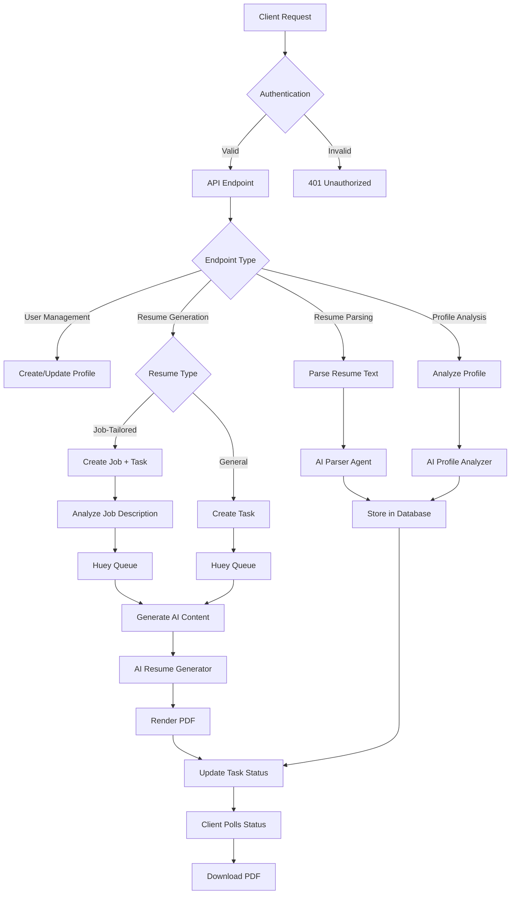
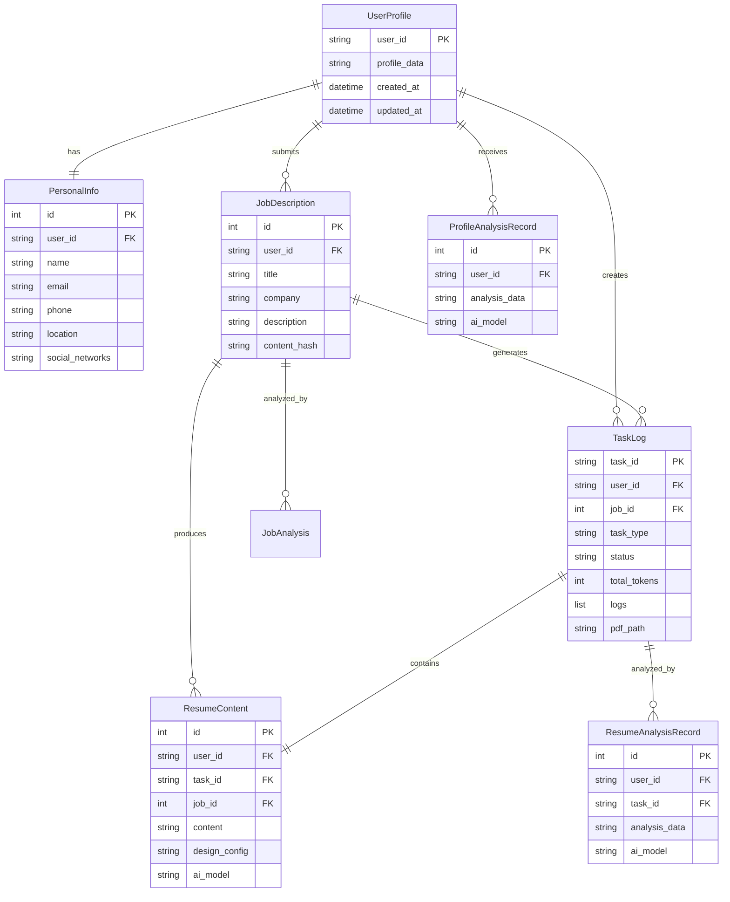

# ResumeEngine

## Overview

ResumeEngine is a multi-user REST API service that leverages AI agents to parse resumes, analyze profiles, and generate tailored resumes for specific job descriptions. The system uses OpenRouter for AI capabilities, FastAPI for the web framework, SQLModel for database operations, and RenderCV for PDF generation.

## Features

### Core Functionality

- **User Profile Management**: Create and manage user profiles with education, experience, and skills
- **Resume Parsing**: Extract structured data from plain text resumes using AI
- **Profile Analysis**: Get comprehensive feedback on profile strength and areas for improvement
- **General Resume Generation**: Create polished, professional resumes from user profiles
- **Job-Tailored Resume Generation**: Generate optimized resumes for specific job descriptions
- **Resume Analysis**: Analyze generated resumes for ATS compatibility and effectiveness
- **Multi-User Support**: Isolated user data with user ID-based authentication
- **Asynchronous Processing**: Background task processing using Huey task queue
- **PDF Generation**: Professional PDF output using RenderCV with multiple themes

### Analysis Features

- Overall profile/resume scoring (0-100)
- ATS compatibility analysis
- Job alignment scoring
- Keyword optimization suggestions
- Strengths and weaknesses identification
- Actionable improvement recommendations
- Missing elements detection

## Architecture

### System Components

1. **FastAPI Application**: REST API server handling HTTP requests
2. **Agno AI Agents**: Specialized agents for parsing, analysis, and generation
3. **Huey Task Queue**: Asynchronous background task processing
4. **SQLite Database**: Data persistence for users, jobs, tasks, and analyses
5. **RenderCV**: PDF rendering engine with Typst backend
6. **OpenRouter**: AI model provider interface

### Flow Diagram



### Database Schema



## Installation

### Prerequisites

- Python 3.13+
- UV package manager
- OpenRouter API key

### Setup Steps

1. Clone the repository:

```bash
git clone <repository-url>
cd resume-maker/app
```

2. Create environment file:

```bash
cat > .env << EOF
OPENROUTER_API_KEY=your-key-here
EOF
```

3. Install dependencies:

```bash
uv sync
```

4. Initialize database:

```bash
uv run python -c "from resume_generator import create_db_and_tables; create_db_and_tables()"
```

5. Start the Huey worker (in separate terminal):

```bash
uv run huey_consumer resume_generator.huey
```

6. Start the API server:

```bash
uv run fastapi dev resume_generator.py
```

The API will be available at `http://localhost:8000`

## API Reference

### Authentication

All endpoints require two headers:

- `X-Api-Key`: API token
- `X-User-Id`: Unique user identifier

### User Management Endpoints

#### Create User Profile

```http
POST /users
Content-Type: application/json
X-Api-Key: <API-TOKEN>
X-User-Id: 1

{
  "name": "John Doe",
  "email": "john@example.com",
  "phone": "9876543210",
  "country_code": "+91",
  "location": "Mumbai, India",
  "social_networks": [
    {"network": "LinkedIn", "username": "johndoe"}
  ],
  "profile_data": {
    "education": [...],
    "experience": [...],
    "skills": {...}
  }
}
```

#### Parse Resume and Create Profile

```http
POST /users/from-resume
Content-Type: application/json
X-Api-Key: <API-TOKEN>
X-User-Id: 1

{
  "resume_text": "Full resume text here...",
  "overwrite_existing": false
}
```

#### Get User Profile

```http
GET /users/me
X-Api-Key: <API-TOKEN>
X-User-Id: 1
```

#### Update Contact Information

```http
PUT /users/me/contact
Content-Type: application/json
X-Api-Key: <API-TOKEN>
X-User-Id: 1

{
  "name": "Jane Doe",
  "email": "jane@example.com",
  "phone": "9999999999",
  "country_code": "+1",
  "location": "San Francisco, USA",
  "social_networks": [...]
}
```

#### Update Profile Data

```http
PUT /users/me/profile
Content-Type: application/json
X-Api-Key: <API-TOKEN>
X-User-Id: 1

{
  "education": [...],
  "experience": [...],
  "skills": {...}
}
```

### Profile Analysis Endpoints

#### Analyze Profile

```http
POST /profile/analyze
Content-Type: application/json
X-Api-Key: <API-TOKEN>
X-User-Id: 1

{
  "ai_model": "google/gemini-2.5-flash-lite"
}
```

Response includes:

- Overall score (0-100)
- Strengths
- Areas for improvement
- Actionable suggestions
- Missing elements
- Keyword optimization tips

#### Get Profile Analysis History

```http
GET /profile/analyze/history
X-Api-Key: <API-TOKEN>
X-User-Id: 1
```

#### Get Analysis Details

```http
GET /profile/analyze/{analysis_id}
X-Api-Key: <API-TOKEN>
X-User-Id: 1
```

### Resume Generation Endpoints

#### Generate General Resume

```http
POST /resumes/generate
Content-Type: application/json
X-Api-Key: <API-TOKEN>
X-User-Id: 1

{
  "enhancement_remarks": "Make it more professional",
  "ai_model": "google/gemini-2.5-flash-lite",
  "design_config": {
    "theme": "moderncv"
  }
}
```

#### Generate Job-Tailored Resume

```http
POST /resumes/job-tailored
Content-Type: application/json
X-Api-Key: <API-TOKEN>
X-User-Id: 1

{
  "title": "Senior Backend Engineer",
  "company": "BigTech Corp",
  "description": "Full job description...",
  "ai_model": "google/gemini-2.5-flash-lite",
  "design_config": {
    "theme": "sb2nov"
  }
}
```

### Resume Analysis Endpoints

#### Analyze Generated Resume

```http
POST /resumes/{task_id}/analyze
Content-Type: application/json
X-Api-Key: <API-TOKEN>
X-User-Id: 1

{
  "ai_model": "google/gemini-2.5-flash-lite"
}
```

Response includes:

- Overall score (0-100)
- ATS compatibility score (0-100)
- Job alignment score (for tailored resumes)
- Strengths and weaknesses
- Formatting issues
- Keyword optimization

#### Get Resume Analysis History

```http
GET /resumes/analyze/history
X-Api-Key: <API-TOKEN>
X-User-Id: 1
```

#### Get Resume Analysis Details

```http
GET /resumes/analyze/{analysis_id}
X-Api-Key: <API-TOKEN>
X-User-Id: 1
```

### Task Management Endpoints

#### List All Tasks

```http
GET /tasks
X-Api-Key: <API-TOKEN>
X-User-Id: 1
```

#### Get Task Status

```http
GET /tasks/{task_id}
X-Api-Key: <API-TOKEN>
X-User-Id: 1
```

#### Get Resume Content

```http
GET /tasks/{task_id}/resume
X-Api-Key: <API-TOKEN>
X-User-Id: 1
```

#### Regenerate Resume

```http
POST /tasks/{task_id}/regenerate
Content-Type: application/json
X-Api-Key: <API-TOKEN>
X-User-Id: 1

{
  "improvement_remarks": "Add more metrics",
  "design_config": {
    "theme": "sb2nov"
  }
}
```

#### Download PDF

```http
GET /tasks/{task_id}/download
X-Api-Key: <API-TOKEN>
X-User-Id: 1
```

### Job Management Endpoints

#### List All Jobs

```http
GET /jobs
X-Api-Key: <API-TOKEN>
X-User-Id: 1
```

### Statistics Endpoints

#### Get User Statistics

```http
GET /users/me/stats
X-Api-Key: <API-TOKEN>
X-User-Id: 1
```

## Task Status Flow

```
General Resume:
pending -> resume_in_progress -> resume_complete

Job-Tailored Resume:
pending -> analysis_in_progress -> analysis_complete -> resume_in_progress -> resume_complete

Error states:
Any status -> error
```

## Testing

### Run All Tests

```bash
uv run pytest test_resume_generator.py -v
```

### Run Specific Test Class

```bash
uv run pytest test_resume_generator.py::TestUserManagement -v
```

### Run with Output

```bash
uv run pytest test_resume_generator.py -v -s
```

### Run Specific Test

```bash
uv run pytest test_resume_generator.py -k "test_create_user" -v
```

The test suite includes:

- User management tests
- Resume parsing tests
- Profile analysis tests
- Resume generation tests
- Resume analysis tests
- Job management tests
- Task management tests
- Error handling tests
- End-to-end integration tests

Tests use in-memory SQLite database and mock content for background tasks, ensuring fast and reliable execution without requiring external services.

## Technology Stack

- **FastAPI**: Modern, high-performance web framework
- **SQLModel**: SQL database ORM with Pydantic integration
- **Agno**: AI agent framework with structured output support
- **OpenRouter**: Multi-model AI API provider
- **Huey**: Lightweight task queue for background processing
- **RenderCV**: Resume rendering engine with Typst backend
- **Pydantic**: Data validation and serialization
- **Pytest**: Testing framework

## Configuration

### Supported AI Models

Default model: `google/gemini-2.5-flash-lite`

Other supported models:

- `anthropic/claude-3.5-sonnet`
- `openai/gpt-4o`
- `openai/gpt-4o-mini`
- Any model available on OpenRouter

### Available Resume Themes

- `classic`: Traditional professional style
- `moderncv`: Modern, clean design
- `sb2nov`: Popular GitHub template style
- `engineeringresumes`: Technical-focused layout

### Design Configuration Options

```json
{
  "theme": "moderncv",
  "colors": {
    "section_titles": "rgb(0, 79, 144)"
  },
  "page": {
    "size": "a4"
  }
}
```

## Error Codes

- `USER_EXISTS`: User profile already exists
- `USER_NOT_FOUND`: User profile not found
- `TASK_NOT_FOUND`: Task not found or unauthorized
- `RESUME_NOT_FOUND`: Resume content not available
- `ANALYSIS_NOT_FOUND`: Analysis record not found
- `PARSING_ERROR`: Failed to parse resume text
- `ANALYSIS_ERROR`: Failed to analyze profile/resume
- `AI_VALIDATION_ERROR`: AI response validation failed

## Performance Considerations

- Job description analysis is cached by content hash
- AI content is reused when only design changes are requested
- Background processing prevents blocking API responses
- Token usage is tracked per task for cost monitoring

## Security Notes

- Change default API token in production
- User data is isolated by user_id
- No cross-user data access
- API key validation on all endpoints
- File downloads require authentication

## Development

### Adding New Endpoints

1. Define request/response models using Pydantic
2. Implement endpoint with proper authentication
3. Add corresponding tests
4. Update this README

### Modifying AI Agents

Agent instructions are defined in `create_*_agent()` functions. Modify instructions to adjust AI behavior while maintaining output schema compatibility.

## Todo

- Database migrations using alembic.
- Simple WebUI and user dashboard.
